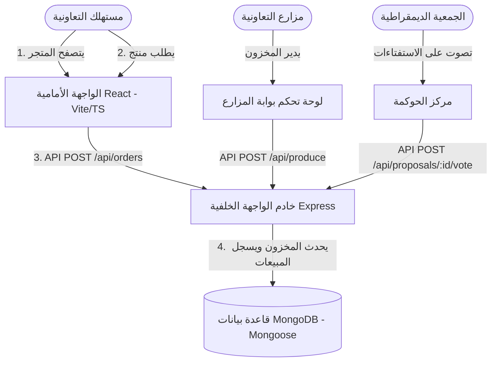

# تجمع المزارعين: منصة تعاونية مباشرة من المزارع إلى المستهلك

> [!IMPORTANT]
> **إثبات المفهوم (PoC) ونموذج أولي فقط**  
> يحتوي هذا المستودع على النموذج الأولي للتطوير، والبنية البرمجية المحلية، وإثبات المفهوم (PoC) لمنصة "تجمع المزارعين" (Growers' Collective). هذا **ليس** النشر الإنتاجي النهائي. في الإصدار الفعلي، يجب استضافة تطبيق الويب الأساسي على رابط نطاق مخصص ومسجل (على سبيل المثال، `https://growerscollective.ie`) وربطه بقواعد بيانات سحابية مخصصة للإنتاج ونقاط نهاية لواجهة برمجة التطبيقات (API) مؤمنة ببروتول TLS.

[](#ميثاق-التسعير-المقترح)
[](#التعبئة-متعددة-المنصات-الأجهزة-المكتبية-والهواتف-المحمولة)
[](#التوطين-الإقليمي-المشروع-التجريبي-في-أيرلندا)
[](https://vimes1984.github.io/coop-harvest/)

**العرض الحي (صفحات GitHub)**: [vimes1984.github.io/coop-harvest/](https://vimes1984.github.io/coop-harvest/)

إن **تجمع المزارعين** (Growers' Collective) هي منصة رقمية مفتوحة المصدر، تُدار ديمقراطياً وتعود ملكيتها للجمعية التعاونية. تم تصميمها لتعمل كممكّن لـ **الزراعة المدعومة من المجتمع والشبكية (CSA)** وأداة نشاط للسيادة الغذائية، وتجاوز احتكارات السوبرماركت الكبرى لربط المزارعين العضويين المحليين مباشرة بالمستهلكين الأعضاء.

---

## 🎨 الهوية البصرية والواجهة
إليك الهوية البصرية المصممة لمتجرنا التعاوني:


---

## 🏗️ بنية النظام وتدفق البيانات

تم تنظيم المشروع كمستودع أحادي منفصل (Decoupled Monorepo):
1. **الواجهة الأمامية (`/frontend`)**: تطبيق صفحة واحدة (SPA) عالي الدقة تم بناؤه باستخدام **React** و **Vite** و **TypeScript**، وتم تنسيقه باستخدام **Vanilla CSS** للحصول على واجهة زجاجية (glassmorphic) مميزة. مجهز بمنطق احتياطي وهمي (mock fallback) للتشغيل المباشر باستخدام التخزين المحلي (local storage) في حال كانت قاعدة البيانات غير متصلة بالإنترنت.
2. **الواجهة الخلفية (`/backend`)**: واجهة برمجة تطبيقات REST خفيفة الوزن تم بناؤها باستخدام **Node.js** و **Express** و **TypeScript** و **Mongoose** (MongoDB).
3. **مغلفات متعددة المنصات**: 
   - تهيئة **Electron** لإصدارات الأجهزة المكتبية الأصلية.
   - تكامل **Capacitor** لتصدير حزم الهواتف المحمولة الأصلية لنظامي **iOS** و **Android**.



---

## ☘️ التوطين الإقليمي (المشروع التجريبي في أيرلندا)
لتأصيل المرحلة التجريبية، تم إعداد المنصة بإحداثيات وبيانات مقرها في **أيرلندا**:
* **المستودع المركزي (مركز اللوجستيات)**: مستودع تعاونية دبلن.
* **آرثر غرين (مزارع وادي الخضار - GreenValley Farms)**: تقع في تلال ويكلو، وتتخصص في الطماطم العضوية والكرنب المجعد الطازج (kale).
* **كلارا ميدو (ألبان المروج الطازجة - MeadowFresh Dairy)**: تقع في غولدن فيل، كورك، وتتخصص في جبن الشيدر الحرفي المعتق والزبدة الطبيعية.
* **جون بيكر (مزرعة الحبوب الذهبية - GoldenGrains Farm)**: تقع في خليج غالواي، وتتخصص في خبز العجين المخمر التقليدي المطحون بالحجر.

---

## 💰 ميثاق التسعير المقترح
تضع التعاونية نموذجاً لهيكل تسعير مستهدف وشفاف للعمليات الحية المستقبلية:
* **حصة المزارع (82%)**: التحويل المباشر المستهدف إلى المزرعة.
* **لوجستيات التعاونية (13%)**: متوقعة لصيانة شاحنات التوصيل المجتمعية، ووحدات التخزين البارد، ومسارات التوزيع الإقليمية.
* **إدارة التعاونية (5%)**: مخصصة لرسوم معالجة بوابة الدفع وصيانة البرمجيات.

---

## 🛠️ دليل التنفيذ خطوة بخطوة

### 1. تشغيل خادم الواجهة الخلفية (Express + MongoDB)
تثبيت الاعتماديات وتشغيل خادم التطوير:
```bash
# الانتقال إلى دليل الواجهة الخلفية
cd backend

# تثبيت اعتماديات الحزمة
npm install

# تشغيل خادم Express في وضع التطوير مع إعادة التحميل التلقائي
npm run dev
```
*ملاحظة: تأكد من إعداد متغير البيئة `MONGO_URI` في الملف `backend/.env`. إذا كانت قاعدة البيانات فارغة، سيقوم الخادم تلقائياً بإدخال البيانات الأولية للمزارعين الأيرلنديين، والمنتجات العضوية، ومقترحات الحوكمة النشطة.*

### 2. تشغيل تطبيق الويب للواجهة الأمامية (React + Vite + TypeScript)
في نافذة طرفية منفصلة:
```bash
# الانتقال إلى دليل الواجهة الأمامية
cd frontend

# تثبيت الاعتماديات (تخطي البرامج النصية للتحقق من esbuild الأصلي إذا لزم الأمر)
npm install --ignore-scripts

# تشغيل خادم متصفح الويب المحدث تلقائياً
npm run dev
```
افتح الرابط [http://localhost:5173](http://localhost:5173) في متصفحك.

---

## 📱 التعبئة متعددة المنصات: الأجهزة المكتبية والهواتف المحمولة

### الأجهزة المكتبية الأصلية (Electron)
حزمة `electron` مهيأة مسبقاً. لتشغيل غلاف الأجهزة المكتبية الأصلي للتطوير:
```bash
# تشغيل غلاف تطوير Electron (يُحمّل رابط خادم تطوير Vite)
npm run electron:dev
```

لحزم برنامج التثبيت للأجهزة المكتبية للإنتاج (`.deb` أو `.dmg` أو `.exe`):
```bash
# تجميع موقع React الثابت
npm run build

# حزم ملف الأجهزة المكتبية القابل للتنفيذ باستخدام electron-builder
npm run electron:build
```

### الهواتف المحمولة الأصلية (iOS و Android عبر Capacitor)
لتصدير قاعدة الكود إلى تطبيقات الهواتف المحمولة:

1. أضف منصة الهاتف المحمول الأصلية المستهدفة:
```bash
# إضافة قالب مشروع أندرويد الأصلي
npx cap add android

# إضافة قالب مشروع iOS الأصلي
npx cap add ios
```

2. قم بتجميع ومزامنة التغييرات مع مشاريع الهاتف المحمول:
```bash
# إعادة بناء حزمة إنتاج React
npm run build

# مزامنة الأصول الثابتة المجمعة في غلافي أندرويد و iOS
npx cap sync
```

3. افتح المنصات في Android Studio أو Xcode لتجميع ملفات التطبيق النهائية `.apk` أو `.aab` أو `.ipa`:
```bash
# فتح مشروع أندرويد في Android Studio
npx cap open android

# فتح مشروع iOS في Xcode
npx cap open ios
```

---

## 🚀 النشر السحابي

### 1. إعداد قاعدة بيانات MongoDB (MongoDB Atlas)
1. قم بالتسجيل للحصول على عنقود مشترك مجاني (shared cluster) على **[mongodb.com/atlas](https://www.mongodb.com/cloud/atlas)**.
2. تحت **Network Access** (الوصول إلى الشبكة)، أضف `0.0.0.0/0` إلى القائمة البيضاء (للسماح بالوصول دون خادم).
3. تحت **Database Access** (الوصول إلى قاعدة البيانات)، أنشئ مستخدماً (على سبيل المثال `coop_user`) وكلمة مرور.
4. انسخ سلسلة الاتصال والصقها في **`backend/.env`** تحت متغير `MONGO_URI`، مع استبدال `<db_password>` بكلمة مرور مستخدم قاعدة البيانات الخاصة بك.

### 2. نشر الواجهة الأمامية (صفحات GitHub)
يحتوي المشروع على برامج نصية مهيأة مسبقاً لصفحات GitHub:
```bash
# تشغيل البرنامج النصي للنشر التلقائي من مجلد الواجهة الأمامية
cd frontend
npm run deploy
```
*تأكد من تمكين خيار Pages في إعدادات المستودع الخاص بك على GitHub، وتهيئته للعمل من فرع `gh-pages`.*

---

## 📜 الترخيص
هذا المشروع مرخص بموجب **رخصة MIT** - راجع ملف LICENSE لمعرفة التفاصيل.
