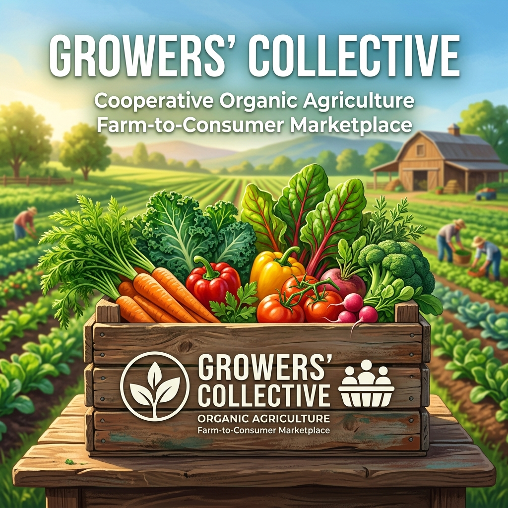
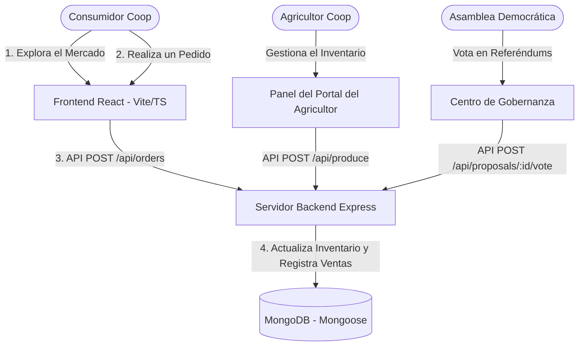

# Growers' Collective: Plataforma Cooperativa Directa de la Granja al Consumidor

> [!IMPORTANT]
> **ÚNICAMENTE PRUEBA DE CONCEPTO (PoC) Y PROTOTIPO**  
> Este repositorio contiene el prototipo de desarrollo, la arquitectura local y la Prueba de Concepto (PoC) para la plataforma Growers' Collective. **NO** es el despliegue de producción final. En un lanzamiento en vivo, la aplicación web principal debe estar alojada en una URL de dominio registrado y dedicado (por ejemplo, `https://growerscollective.ie`) y vinculada a bases de datos en la nube de nivel de producción y puntos de conexión de API protegidos por TLS.

[](#the-pricing-charter)
[](#cross-platform-packaging)
[](#regional-localization)
[](https://vimes1984.github.io/coop-harvest/)

**Demostración en Vivo (GitHub Pages)**: [vimes1984.github.io/coop-harvest/](https://vimes1984.github.io/coop-harvest/)

**Growers' Collective** es una plataforma digital de código abierto, gobernada democráticamente y de propiedad cooperativa. Está diseñada para funcionar como un facilitador de **Agricultura Respaldada por la Comunidad (CSA) en Red** y una herramienta de activismo por la soberanía alimentaria, evitando los oligopolios de los supermercados para conectar a los productores locales y ecológicos directamente con los miembros-consumidores.

---

## 🎨 Identidad Visual e Interfaz
Aquí está la identidad visual diseñada para nuestro mercado cooperativo:



---

## 🏗️ Arquitectura del Sistema y Flujo de Datos

El proyecto está estructurado como un monorepositorio desacoplado:
1. **Frontend (`/frontend`)**: Una aplicación de página única (SPA) de alta fidelidad construida con **React**, **Vite**, **TypeScript** y estilizada con **CSS Vanilla** para una interfaz glassmorphic premium. Equipada con lógica de respaldo simulada para funcionar directamente usando el almacenamiento local si la base de datos está fuera de línea.
2. **Backend (`/backend`)**: Una API REST ligera construida con **Node.js**, **Express**, **TypeScript** y **Mongoose** (MongoDB).
3. **Contenedores multiplataforma**: 
   - Configuración de **Electron** para compilaciones de escritorio nativas.
   - Integración de **Capacitor** para exportar a paquetes móviles nativos de **iOS** y **Android**.



---

## ☘️ Localización Regional (Piloto de Irlanda)
Para fundamentar la fase piloto, la plataforma está configurada con coordenadas y datos basados en **Irlanda**:
* **Depósito Central (Centro Logístico)**: Dublin Coop Depot.
* **Arthur Green (GreenValley Farms)**: Ubicado en las colinas de Wicklow, especializado en tomates ecológicos y col rizada (kale) crujiente.
* **Clara Meadow (MeadowFresh Dairy)**: Ubicada en Golden Vale, Cork, especializada en queso cheddar artesanal curado y mantequilla de vacas alimentadas con pasto.
* **John Baker (GoldenGrains Farm)**: Ubicado en la bahía de Galway, especializado en panes de masa madre ancestrales molidos a la piedra.

---

## 💰 Estatuto de Precios Propuesto
La cooperativa modela una estructura de precios objetivo transparente para futuras operaciones en vivo:
* **Participación del Agricultor (82%)**: Transferencia directa objetiva a la granja.
* **Logística de la Cooperativa (13%)**: Proyectado para el mantenimiento de furgonetas de reparto comunitarias, unidades de almacenamiento en frío y rutas de distribución regional.
* **Administración de la Cooperativa (5%)**: Dedicado a las tarifas de procesamiento de la pasarela de pago y al mantenimiento del software.

---

## 🛠️ Guía de Ejecución Paso a Paso

### 1. Iniciar el Servidor Backend (Express + MongoDB)
Instala las dependencias y ejecuta el servidor de desarrollo:
```bash
# Navegar al directorio backend
cd backend

# Instalar dependencias del paquete
npm install

# Iniciar el servidor Express en modo de desarrollo con recarga en caliente
npm run dev
```
*Nota: Asegúrate de que tu `MONGO_URI` esté configurada en `backend/.env`. Si la base de datos está vacía, el servidor sembrará automáticamente a los agricultores irlandeses iniciales, productos ecológicos y propuestas de gobernanza activas.*

### 2. Iniciar la Aplicación Web Frontend (React + Vite + TypeScript)
En una terminal separada:
```bash
# Navegar al directorio frontend
cd frontend

# Instalar dependencias (omitiendo los scripts de verificación nativos de esbuild si es necesario)
npm install --ignore-scripts

# Iniciar el servidor del navegador web con recarga en caliente
npm run dev
```
Abre [http://localhost:5173](http://localhost:5173) en tu navegador.

---

## 📱 Empaquetado Multiplataforma: Escritorio y Móvil

### Escritorio Nativo (Electron)
El paquete `electron` está preconfigurado. Para iniciar el contenedor de la interfaz de escritorio nativa:
```bash
# Iniciar el entorno de desarrollo de Electron (carga la URL del servidor de desarrollo de Vite)
npm run electron:dev
```

Para empaquetar un instalador de escritorio de producción (`.deb`, `.dmg` o `.exe`):
```bash
# Compilar el sitio estático de React
npm run build

# Empaquetar el ejecutable de escritorio usando electron-builder
npm run electron:build
```

### Móvil Nativo (iOS y Android a través de Capacitor)
Para exportar la base de código a aplicaciones móviles:

1. Agrega tu plataforma móvil nativa objetivo:
```bash
# Agregar la plantilla de proyecto nativo de Android
npx cap add android

# Agregar la plantilla de proyecto nativo de iOS
npx cap add ios
```

2. Compila y sincroniza los cambios con los proyectos móviles:
```bash
# Recompilar el paquete de producción de React
npm run build

# Sincronizar los activos estáticos compilados en los contenedores de Android e iOS
npx cap sync
```

3. Abre las plataformas en Android Studio o Xcode para compilar los archivos finales de la aplicación `.apk`, `.aab` o `.ipa`:
```bash
# Abrir el proyecto de Android en Android Studio
npx cap open android

# Abrir el proyecto de iOS en Xcode
npx cap open ios
```

---

## 🚀 Despliegue en la Nube

### 1. Configuración de la Base de Datos MongoDB (MongoDB Atlas)
1. Regístrate para obtener un clúster compartido gratuito en **[mongodb.com/atlas](https://www.mongodb.com/cloud/atlas)**.
2. En **Network Access** (Acceso de Red), añade `0.0.0.0/0` a la lista blanca (lo que permite el acceso serverless).
3. En **Database Access** (Acceso a la Base de Datos), crea un usuario (por ejemplo, `coop_user`) y una contraseña.
4. Copia la cadena de conexión y pégala en **`backend/.env`** bajo `MONGO_URI`, reemplazando `<db_password>` con la contraseña del usuario de tu base de datos.

### 2. Despliegue del Frontend (GitHub Pages)
El proyecto contiene scripts preconfigurados para GitHub Pages:
```bash
# Ejecutar el script de despliegue automático desde la carpeta frontend
cd frontend
npm run deploy
```
*Asegúrate de que la configuración de tu repositorio en GitHub tenga Pages habilitado y configurado para servir desde la rama `gh-pages`.*

---

## 📜 Licencia
Este proyecto está bajo la **Licencia MIT** - consulta el archivo LICENSE para más detalles.
