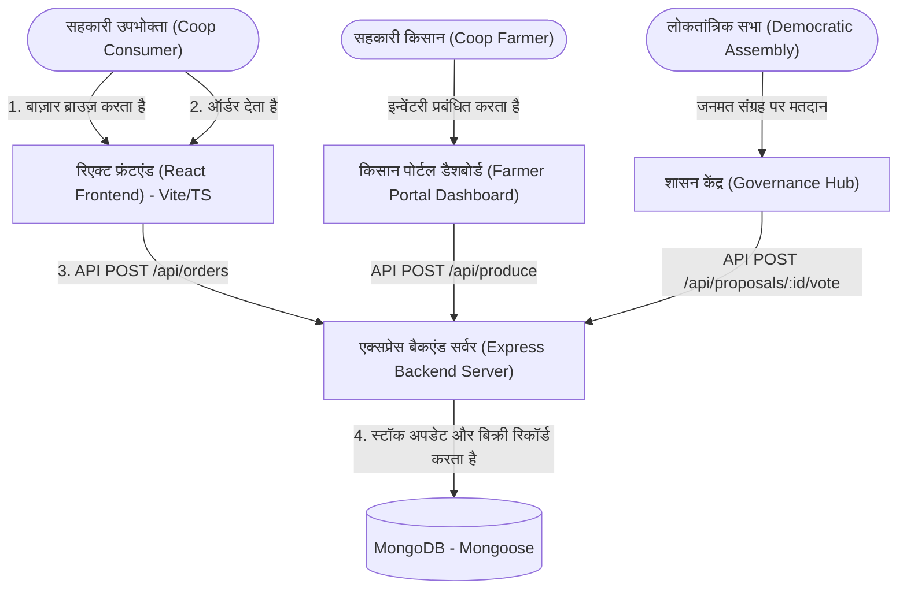

# ग्रोअर्स कलेक्टिव (Growers' Collective): प्रत्यक्ष फार्म-टू-कंज्यूमर सहकारी मंच (Direct Farm-to-Consumer Cooperative Platform)

> [!IMPORTANT]
> **केवल प्रूफ ऑफ कॉन्सेप्ट (PoC) और प्रोटोटाइप**  
> यह रिपॉजिटरी ग्रोअर्स कलेक्टिव (Growers' Collective) प्लेटफॉर्म के लिए डेवलपमेंट प्रोटोटाइप, स्थानीय आर्किटेक्चर और प्रूफ ऑफ कॉन्सेप्ट (PoC) प्रदान करती है। यह अंतिम प्रोडक्शन परिनियोजन (production deployment) **नहीं** है। लाइव रिलीज में, मुख्य वेब एप्लिकेशन को एक समर्पित, पंजीकृत डोमेन URL (जैसे, `https://growerscollective.ie`) पर होस्ट किया जाना चाहिए और प्रोडक्शन-ग्रेड क्लाउड डेटाबेस तथा TLS-सुरक्षित API एंडपॉइंट से जोड़ा जाना चाहिए।

[](#the-pricing-charter)
[](#cross-platform-packaging)
[](#regional-localization)
[](https://vimes1984.github.io/coop-harvest/)

**लाइव डेमो (GitHub Pages)**: [vimes1984.github.io/coop-harvest/](https://vimes1984.github.io/coop-harvest/)

**ग्रोअर्स कलेक्टिव (Growers' Collective)** एक ओपन-सोर्स, लोकतांत्रिक रूप से शासित और सहकारी स्वामित्व वाला डिजिटल प्लेटफॉर्म है। इसे एक **नेटवर्क्ड कम्युनिटी सपोर्टेड एग्रीकल्चर (CSA)** इनेबलेर और खाद्य संप्रभुता (food sovereignty) कार्यकर्ता उपकरण के रूप में कार्य करने के लिए डिज़ाइन किया गया है, जो सुपरमार्केट एकाधिकार (oligopolies) को दरकिनार करते हुए स्थानीय, जैविक उत्पादकों को सीधे उपभोक्ता-सदस्यों से जोड़ता है।

---

## 🎨 दृश्य पहचान और इंटरफ़ेस (Visual Identity & Interface)
यहाँ हमारे सहकारी बाज़ार (cooperative marketplace) के लिए डिज़ाइन की गई दृश्य पहचान है:


---

## 🏗️ सिस्टम आर्किटेक्चर और डेटा प्रवाह (System Architecture & Data Flow)

यह परियोजना एक डिकपल्ड मोनोरेपो (decoupled monorepo) के रूप में संरचित है:
1. **फ्रंटएंड (`/frontend`)**: एक हाई-फिडेलिटी सिंगल पेज एप्लीकेशन (Single Page Application) जो **React**, **Vite**, **TypeScript** से बनी है और प्रीमियम ग्लासमॉर्फिक इंटरफ़ेस के लिए **Vanilla CSS** के साथ स्टाइल की गई है। डेटाबेस के ऑफलाइन होने की स्थिति में लोकल स्टोरेज का उपयोग करके आउट-ऑफ-द-बॉक्स चलाने के लिए मॉक फॉलबैक लॉजिक से सुसज्जित है।
2. **बैकएंड (`/backend`)**: **Node.js**, **Express**, **TypeScript**, और **Mongoose** (MongoDB) के साथ बनाई गई एक हल्की REST API।
3. **क्रॉस-प्लेटफॉर्म रैपर्स**: 
   - नेटिव डेस्कटॉप बिल्ड के लिए **Electron** कॉन्फ़िगरेशन।
   - नेटिव **iOS** और **Android** मोबाइल पैकेजों में निर्यात करने के लिए **Capacitor** एकीकरण।



---

## ☘️ क्षेत्रीय स्थानीयकरण (आयरलैंड पायलट)
पायलट चरण को धरातल पर लाने के लिए, प्लेटफॉर्म को **आयरलैंड** में स्थित निर्देशांकों (coordinates) और डेटा के साथ कॉन्फ़िगर किया गया है:
* **केंद्रीय डिपो (लॉजिस्टिक्स हब)**: डब्लिन कॉप डिपो (Dublin Coop Depot)।
* **आर्थर ग्रीन (GreenValley Farms)**: विकलो हिल्स (Wicklow Hills) में स्थित, जैविक टमाटर और कुरकुरी केल (kale) में विशेषज्ञता।
* **क्लारा मीडो (MeadowFresh Dairy)**: गोल्डन वेल (Golden Vale), कॉर्क (Cork) में स्थित, पुराने शिल्पकार चेडर (aged artisanal cheddar) और घास खाने वाली गायों के दूध से बने मक्खन में विशेषज्ञता।
* **जॉन बेकर (GoldenGrains Farm)**: गॉलवे बे (Galway Bay) में स्थित, पत्थर की चक्की से पिसे हुए पारंपरिक खमीरी ब्रेड (stone-ground ancient sourdough breads) में विशेषज्ञता।

---

## 💰 प्रस्तावित मूल्य निर्धारण चार्टर (Proposed Pricing Charter)
सहकारी भविष्य के लाइव संचालन के लिए एक पारदर्शी लक्षित मूल्य निर्धारण संरचना का मॉडल तैयार करती है:
* **किसान का हिस्सा (82%)**: खेत (फार्म) में सीधे हस्तांतरण का लक्ष्य।
* **सहकारी लॉजिस्टिक्स (13%)**: सामुदायिक डिलीवरी वैन, कोल्ड स्टोरेज इकाइयों और क्षेत्रीय वितरण मार्गों के रख-रखाव के लिए अनुमानित।
* **सहकारी एडमिन (5%)**: भुगतान गेटवे प्रोसेसिंग शुल्क और सॉफ्टवेयर रखरखाव के लिए समर्पित।

---

## 🛠️ चरण-दर-चरण निष्पादन मार्गदर्शिका (Step-by-Step Execution Guide)

### 1. बैकएंड सर्वर शुरू करना (Express + MongoDB)
निर्भरताएँ (dependencies) स्थापित करें और डेव सर्वर चलाएँ:
```bash
# बैकएंड निर्देशिका पर जाएं
cd backend

# पैकेज निर्भरताएं स्थापित करें
npm install

# हॉट-रीलोड डेवलपमेंट मोड में एक्सप्रेस सर्वर शुरू करें
npm run dev
```
*नोट: सुनिश्चित करें कि आपका `MONGO_URI` फ़ाइल `backend/.env` में सेट है। यदि डेटाबेस खाली है, तो सर्वर स्वचालित रूप से शुरुआती आयरिश किसानों, जैविक उपज और सक्रिय शासन प्रस्तावों को सीड (seed) कर देगा।*

### 2. फ्रंटएंड वेब ऐप शुरू करना (React + Vite + TypeScript)
एक अलग टर्मिनल में:
```bash
# फ्रंटएंड निर्देशिका पर जाएं
cd frontend

# निर्भरताएं स्थापित करें (यदि आवश्यक हो तो नेटिव esbuild चेक स्क्रिप्ट को छोड़ दें)
npm install --ignore-scripts

# हॉट-रीलोडिंग वेब ब्राउज़र सर्वर लॉन्च करें
npm run dev
```
अपने ब्राउज़र में [http://localhost:5173](http://localhost:5173) खोलें।

---

## 📱 क्रॉस-प्लेटफॉर्म पैकेजिंग: डेस्कटॉप और मोबाइल

### नेटिव डेस्कटॉप (Electron)
`electron` पैकेज पहले से कॉन्फ़िगर किया गया है। नेटिव डेस्कटॉप शेल रैपर लॉन्च करने के लिए:
```bash
# इलेक्ट्रॉन डेव शेल लॉन्च करें (Vite डेव सर्वर URL लोड करता है)
npm run electron:dev
```

उत्पादन (production) डेस्कटॉप इंस्टॉलर (`.deb`, `.dmg`, या `.exe`) को बंडल करने के लिए:
```bash
# रिएक्ट स्टैटिक साइट संकलित (compile) करें
npm run build

# electron-builder का उपयोग करके डेस्कटॉप निष्पादन योग्य (executable) बंडल करें
npm run electron:build
```

### नेटिव मोबाइल (iOS और Android, Capacitor के माध्यम से)
कोडबेस को मोबाइल एप्लिकेशन में निर्यात करने के लिए:

1. अपने लक्षित नेटिव मोबाइल प्लेटफॉर्म को जोड़ें:
```bash
# एंड्रॉइड नेटिव प्रोजेक्ट टेम्पलेट जोड़ें
npx cap add android

# iOS नेटिव प्रोजेक्ट टेम्पलेट जोड़ें
npx cap add ios
```

2. परिवर्तनों को संकलित (compile) करें और मोबाइल प्रोजेक्ट्स में सिंक करें:
```bash
# रिएक्ट प्रोडक्शन पैकेज को फिर से बनाएं (Rebuild)
npm run build

# संकलित स्टैटिक संपत्तियों (assets) को एंड्रॉइड और iOS शेल में सिंक करें
npx cap sync
```

3. अंतिम `.apk`, `.aab`, या `.ipa` ऐप फ़ाइलों को संकलित (compile) करने के लिए एंड्रॉइड स्टूडियो (Android Studio) या एक्सकोड (Xcode) में प्लेटफ़ॉर्म खोलें:
```bash
# एंड्रॉइड प्रोजेक्ट को एंड्रॉइड स्टूडियो में खोलें
npx cap open android

# iOS प्रोजेक्ट को एक्सकोड में खोलें
npx cap open ios
```

---

## 🚀 क्लाउड परिनियोजन (Cloud Deployment)

### 1. मोंगोडीबी डेटाबेस सेटअप (MongoDB Atlas)
1. **[mongodb.com/atlas](https://www.mongodb.com/cloud/atlas)** पर एक निःशुल्क साझा क्लस्टर (shared cluster) के लिए साइन अप करें।
2. **Network Access** के तहत, `0.0.0.0/0` को श्वेतसूची (whitelist) में डालें (सर्वरलेस एक्सेस की अनुमति देने के लिए)।
3. **Database Access** के तहत, एक उपयोगकर्ता (जैसे `coop_user`) और पासवर्ड बनाएं।
4. कनेक्शन स्ट्रिंग को कॉपी करें और इसे **`backend/.env`** में `MONGO_URI` के अंतर्गत पेस्ट करें, जिसमें `<db_password>` को अपने डेटाबेस उपयोगकर्ता के पासवर्ड से बदलें।

### 2. फ्रंटएंड परिनियोजन (GitHub Pages)
प्रोजेक्ट में GitHub Pages के लिए पहले से कॉन्फ़िगर की गई स्क्रिप्ट शामिल हैं:
```bash
# फ्रंटएंड फ़ोल्डर से स्वचालित परिनियोजन (deployment) स्क्रिप्ट चलाएं
cd frontend
npm run deploy
```
*सुनिश्चित करें कि GitHub पर आपकी रिपॉजिटरी सेटिंग्स में Pages सक्षम (enabled) है, और इसे `gh-pages` शाखा (branch) से सेवा देने के लिए कॉन्फ़िगर किया गया है।*

---

## 📜 लाइसेंस (License)
यह प्रोजेक्ट **MIT लाइसेंस (MIT License)** के तहत लाइसेंस प्राप्त है - विवरण के लिए LICENSE फ़ाइल देखें।
