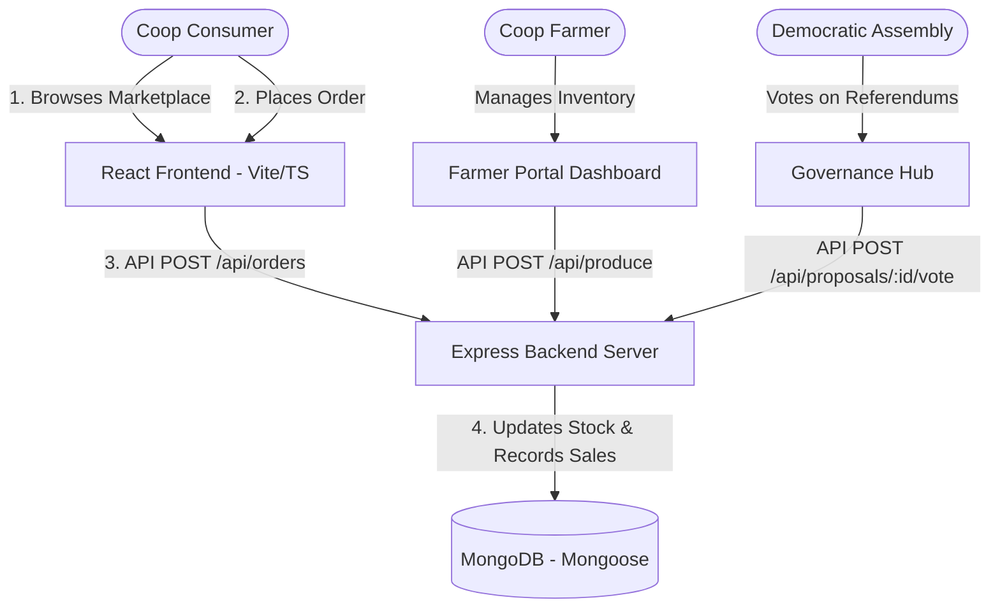

# Growers' Collective: Direct Farm-to-Consumer Cooperative Platform

> [!IMPORTANT]
> **PROOF OF CONCEPT (PoC) & PROTOTYPE ONLY**  
> This repository contains the development prototype, local architecture, and Proof of Concept (PoC) for the Growers' Collective platform. It is **NOT** the final production deployment. In a live release, the core web application must be hosted on a dedicated, registered domain URL (e.g., `https://growerscollective.ie`) and linked to production-grade cloud databases and TLS-secured API endpoints.

[](#the-pricing-charter)
[](#cross-platform-packaging)
[](#regional-localization)

The **Growers' Collective** is an open-source, democratically governed, and cooperatively owned digital platform. It functions as a **Networked Community Supported Agriculture (CSA)** enabler and food sovereignty activist tool, bypassing supermarket oligopolies to connect local, organic growers directly with consumer-members.

By securing direct trade channels and scaling CSA harvest-sharing principles, this platform ensures that **82% of every Euro spent** goes directly to Irish family farms, with the remaining fraction distributed transparently to community logistics and software maintenance.

---

## 🎨 Visual Identity & Interface
Here is the visual identity designed for our cooperative marketplace:


---

## 🏗️ System Architecture & Data Flow

The project is structured as a decoupled monorepo:
1. **Frontend (`/frontend`)**: A high-fidelity Single Page Application built with **React**, **Vite**, **TypeScript**, and styled with **Vanilla CSS** for a premium glassmorphic interface. Equipped with mock fallback logic to run out-of-the-box using local storage if the database is offline.
2. **Backend (`/backend`)**: A lightweight REST API built with **Node.js**, **Express**, **TypeScript**, and **Mongoose** (MongoDB).
3. **Cross-Platform Wrappers**: 
   - **Electron** configuration for Native Desktop builds.
   - **Capacitor** integration for exporting to native **iOS** and **Android** mobile packages.



---

## ☘️ Regional Localization (Ireland Pilot)
To ground the pilot phase, the platform is configured with coordinates and data based in **Ireland**:
* **Central Depot (Logistics Hub)**: Dublin Coop Depot.
* **Arthur Green (GreenValley Farms)**: Located in the Wicklow Hills, specializing in organic tomatoes and crisp kale.
* **Clara Meadow (MeadowFresh Dairy)**: Located in the Golden Vale, Cork, specializing in aged artisanal cheddar and grass-fed butter.
* **John Baker (GoldenGrains Farm)**: Located in Galway Bay, specializing in stone-ground ancient sourdough breads.

---

## 💰 The Pricing Charter
Unlike supermarkets, our pricing structure is 100% transparent:
* **Farmer Share (82%)**: Transferred directly to the farm.
* **Coop Logistics (13%)**: Used to maintain community delivery vans, cold storage units, and regional distribution routes.
* **Coop Admin (5%)**: Dedicated to payment gateway processing fees and software maintenance.

---

## 🛠️ Step-by-Step Execution Guide

### 1. Launching the Backend Server (Express + MongoDB)
Install dependencies and run the dev server:
```bash
# Navigate to backend directory
cd backend

# Install package dependencies
npm install

# Start Express server in hot-reload development mode
npm run dev
```
*Note: Make sure your `MONGO_URI` is set up in `backend/.env`. If the database is empty, the server will automatically seed initial Irish farmers, organic produce, and active governance proposals.*

### 2. Launching the Frontend Web App (React + Vite + TypeScript)
In a separate terminal:
```bash
# Navigate to frontend directory
cd frontend

# Install dependencies (skipping native esbuild check scripts if needed)
npm install --ignore-scripts

# Launch the hot-reloading web browser server
npm run dev
```
Open [http://localhost:5173](http://localhost:5173) in your browser.

---

## 📱 Cross-Platform Packaging: Desktop & Mobile

### Native Desktop (Electron)
The `electron` package is pre-configured. To launch the native desktop shell wrapper:
```bash
# Launch Electron dev shell (loads the Vite dev server URL)
npm run electron:dev
```

To bundle a production desktop installer (`.deb`, `.dmg`, or `.exe`):
```bash
# Compile React static site
npm run build

# Bundle desktop executable using electron-builder
npm run electron:build
```

### Native Mobile (iOS & Android via Capacitor)
To export the codebase to mobile applications:

1. Add your targeted native mobile platform:
```bash
# Add Android native project template
npx cap add android

# Add iOS native project template
npx cap add ios
```

2. Compile and sync changes to the mobile projects:
```bash
# Rebuild the React production package
npm run build

# Sync compiled static assets into the Android & iOS shells
npx cap sync
```

3. Open the platforms in Android Studio or Xcode to compile the final `.apk`, `.aab`, or `.ipa` app files:
```bash
# Open Android project in Android Studio
npx cap open android

# Open iOS project in Xcode
npx cap open ios
```

---

## 🚀 Cloud Deployment

### 1. MongoDB Database Setup (MongoDB Atlas)
1. Sign up for a free shared cluster at **[mongodb.com/atlas](https://www.mongodb.com/cloud/atlas)**.
2. Under **Network Access**, whitelist `0.0.0.0/0` (allowing serverless access).
3. Under **Database Access**, create a user (e.g. `coop_user`) and password.
4. Copy the connection string and paste it into **`backend/.env`** under `MONGO_URI`, replacing `<db_password>` with your database user password.

### 2. Frontend Deployment (GitHub Pages)
The project contains pre-configured scripts for GitHub Pages:
```bash
# Run the automated deployment script from the frontend folder
cd frontend
npm run deploy
```
*Make sure your repository settings on GitHub have Pages enabled, configured to serve from the `gh-pages` branch.*

---

## 📜 License
This project is licensed under the **MIT License** - see the LICENSE file for details.
