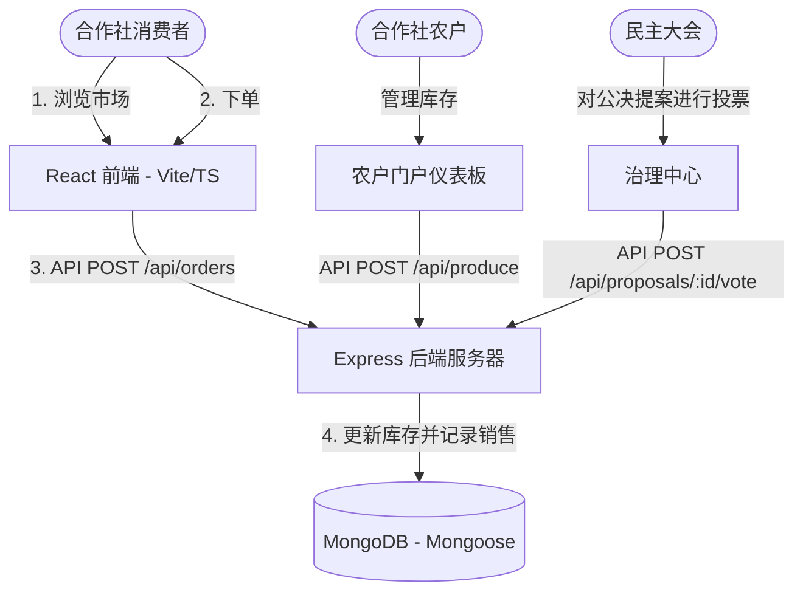

# Growers' Collective: 农户直连消费者合作社平台

> [!IMPORTANT]
> **仅限概念验证 (PoC) 与原型**  
> 本仓库包含 Growers' Collective 平台开发原型、本地架构和概念验证 (PoC)。这**不是**最终的生产环境部署。在正式发布中，核心 Web 应用程序必须托管在专用的已注册域名 URL（例如 `https://growerscollective.ie`）上，并与生产级云数据库和受 TLS 保护的 API 端点连接。

[](#拟议定价章程)
[](#跨平台打包桌面端与移动端)
[](#区域本地化爱尔兰试点)
[](https://vimes1984.github.io/coop-harvest/)

**在线演示 (GitHub Pages)**：[vimes1984.github.io/coop-harvest/](https://vimes1984.github.io/coop-harvest/)

**Growers' Collective** 是一个开源、民主管理且合作社所有的数字化平台。它旨在作为**网络化社区支持农业 (CSA)** 的赋能工具和粮食主权行动主义工具，绕过超市垄断，将本地的有机种植者与消费者成员直接连接起来。

---

## 🎨 视觉识别与界面
以下是为我们的合作社市场设计的视觉识别系统：


---

## 🏗️ 系统架构与数据流

该项目结构为一个解耦的单体多仓库 (Monorepo)：
1. **前端 (`/frontend`)**：一个基于 **React**、**Vite**、**TypeScript** 构建的高保真单页应用 (SPA)，并使用 **Vanilla CSS** 进行了样式设计，以呈现高端的毛玻璃感 (glassmorphic) 界面。配备了模拟回退逻辑，如果数据库处于离线状态，可以使用本地存储 (local storage) 开箱即用地运行。
2. **后端 (`/backend`)**：一个基于 **Node.js**、**Express**、**TypeScript** 和 **Mongoose** (MongoDB) 构建的轻量级 REST API。
3. **跨平台包装器**：
   - 针对原生桌面端构建的 **Electron** 配置。
   - 用于导出为原生 **iOS** 和 **Android** 移动端数据包的 **Capacitor** 集成。



---

## ☘️ 区域本地化（爱尔兰试点）
为了使试点阶段落地，平台配置了基于**爱尔兰**的坐标和数据：
* **中央仓库（物流枢纽）**：都柏林合作社仓库 (Dublin Coop Depot)。
* **Arthur Green (GreenValley Farms)**：位于威克洛山脉 (Wicklow Hills)，专注于有机西红柿和脆羽衣甘蓝。
* **Clara Meadow (MeadowFresh Dairy)**：位于科克黄金谷 (Golden Vale, Cork)，专注于陈年手工切达干酪和草饲黄油。
* **John Baker (GoldenGrains Farm)**：位于高威湾 (Galway Bay)，专注于石磨古法酸面包。

---

## 💰 拟议定价章程
合作社为未来的实际运营模拟了透明的目标定价结构：
* **农户份额 (82%)**：直接转账给农场的目标比例。
* **合作社物流 (13%)**：预计用于维护社区配送货车、冷库单元和区域配送路线。
* **合作社管理 (5%)**：专门用于支付网关手续费和软件维护。

---

## 🛠️ 逐步运行指南

### 1. 启动后端服务器 (Express + MongoDB)
安装依赖项并运行开发服务器：
```bash
# 导航到 backend 目录
cd backend

# 安装包依赖项
npm install

# 以热重载开发模式启动 Express 服务器
npm run dev
```
*注意：请确保在 `backend/.env` 中配置了 `MONGO_URI`。如果数据库为空，服务器将自动播种初始的爱尔兰农户、有机农产品以及活跃的治理提案。*

### 2. 启动前端 Web 应用 (React + Vite + TypeScript)
在另一个终端中：
```bash
# 导航到 frontend 目录
cd frontend

# 安装依赖项（如果需要，跳过原生 esbuild 检查脚本）
npm install --ignore-scripts

# 启动支持热重载的 Web 浏览器服务器
npm run dev
```
在浏览器中打开 [http://localhost:5173](http://localhost:5173)。

---

## 📱 跨平台打包：桌面端与移动端

### 原生桌面端 (Electron)
`electron` 包已预先配置。要启动原生桌面端外壳包装器：
```bash
# 启动 Electron 开发外壳（加载 Vite 开发服务器 URL）
npm run electron:dev
```

打包生产环境的桌面端安装程序（`.deb`、`.dmg` 或 `.exe`）：
```bash
# 编译 React 静态网站
npm run build

# 使用 electron-builder 打包桌面端可执行文件
npm run electron:build
```

### 原生移动端（通过 Capacitor 支持 iOS 和 Android）
要将代码库导出为移动端应用程序：

1. 添加您的目标原生移动平台：
```bash
# 添加 Android 原生项目模板
npx cap add android

# 添加 iOS 原生项目模板
npx cap add ios
```

2. 编译并将更改同步到移动端项目：
```bash
# 重新构建 React 生产环境包
npm run build

# 将编译后的静态资源同步到 Android 和 iOS 外壳中
npx cap sync
```

3. 在 Android Studio 或 Xcode 中打开对应平台以编译最终的 `.apk`、`.aab` 或 `.ipa` 应用文件：
```bash
# 在 Android Studio 中打开 Android 项目
npx cap open android

# 在 Xcode 中打开 iOS 项目
npx cap open ios
```

---

## 🚀 云端部署

### 1. MongoDB 数据库设置 (MongoDB Atlas)
1. 在 **[mongodb.com/atlas](https://www.mongodb.com/cloud/atlas)** 注册一个免费的共享集群。
2. 在 **Network Access**（网络访问）下，将 `0.0.0.0/0` 加入白名单（允许无服务器访问）。
3. 在 **Database Access**（数据库访问）下，创建一个用户（例如 `coop_user`）和密码。
4. 复制连接字符串并将其粘贴到 **`backend/.env`** 的 `MONGO_URI` 下，将 `<db_password>` 替换为您的数据库用户密码。

### 2. 前端部署 (GitHub Pages)
该项目包含针对 GitHub Pages 预配置的脚本：
```bash
# 从 frontend 文件夹运行自动部署脚本
cd frontend
npm run deploy
```
*请确保您在 GitHub 上的仓库设置中启用了 Pages，并配置为从 `gh-pages` 分支提供服务。*

---

## 📜 许可证
本项目采用 **MIT 许可证** 授权 - 详情请参阅 LICENSE 文件。
